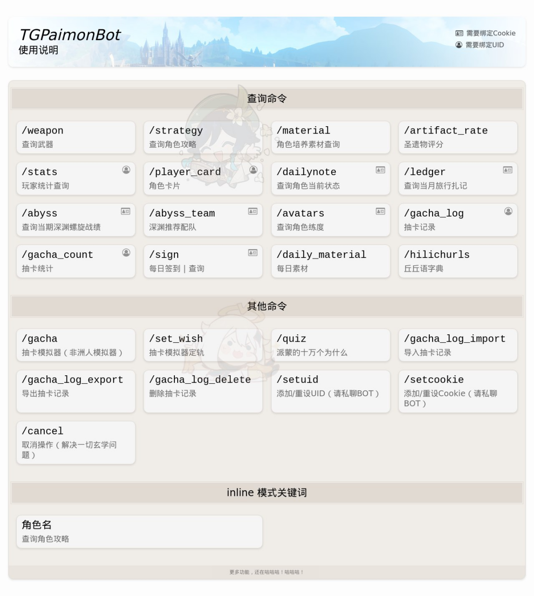

<!--suppress SpellCheckingInspection -->
<h1 align="center">TGPaimonBot</h1>

<div align="center">


<a href="https://black.readthedocs.io/en/stable/index.html"></a>
<a href="https://www.codacy.com/gh/luoshuijs/TGPaimonBot/dashboard?utm_source=github.com&amp;utm_medium=referral&amp;utm_content=luoshuijs/TGPaimonBot&amp;utm_campaign=Badge_Grade"></a>
</div>


<p>

<h2 align="left">简介</h2>

基于 [python-telegram-bot](https://github.com/python-telegram-bot/python-telegram-bot) 的 Paimon BOT

项目仅供学习交流使用，严禁用于任何商业用途和非法行为


## 目前功能



## 环境需求

- Python 3.8+
- MySQL
- Redis

## 使用方法

### 1. 安装 `poetry`

```bash
pip install --upgrade poetry 
```

### 2. 安装依赖

```bash
poetry install
playwright install chromium
```

#### 可选依赖项

```bash
poetry install --extras pyro
```

### 3. 修改配置

创建 `.env` 文件并填写数据库连接和 bot token 等参数。

```bash
cp .env.example .env
```

### 4. 初始化数据库

```bash
alembic upgrade head
```

### 5. 运行

```bash
python ./run.py
```

## 其他说明

这个项目目前正在扩展，加入更多原神相关娱乐和信息查询功能，敬请期待。

## Thanks

|                                Nickname                                 | Introduce        |
|:-----------------------------------------------------------------------:|------------------|
|          [原神抽卡全机制总结](https://www.bilibili.com/read/cv10468091)          | 本项目抽卡模拟器使用的逻辑    |
| [西风驿站 猫冬](https://bbs.mihoyo.com/ys/accountCenter/postList?id=74019947) | 本项目攻略图图源         |
|           [Yunzai-Bot](https://github.com/Le-niao/Yunzai-Bot)           | 本项使用的抽卡图片和前端资源来源 |
|       [Crawler-ghhw](https://github.com/DGP-Studio/Crawler-ghhw)        | 本项目参考的爬虫代码       |
|                  [Enka.Network](https://enka.network)                   | 角色卡片的数据来源        |
|      [miao-plugin](https://github.com/yoimiya-kokomi/miao-plugin)       | 角色卡片的参考项目        |
